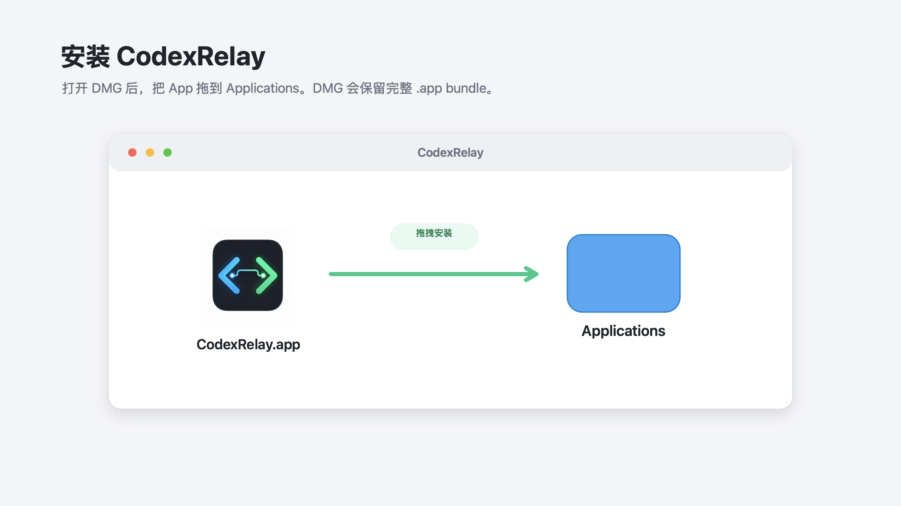
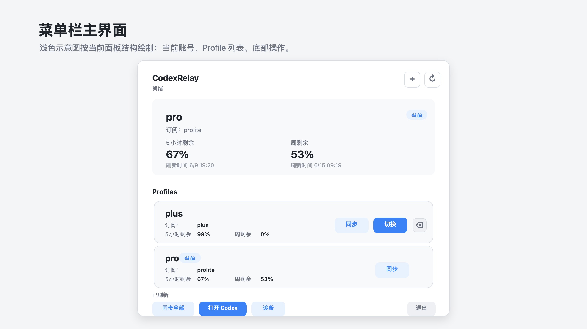
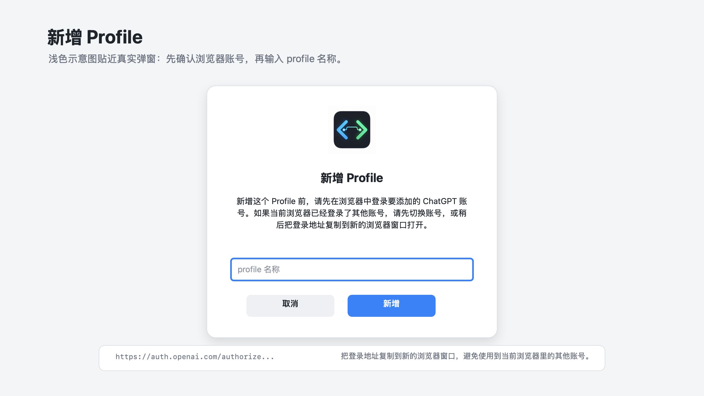
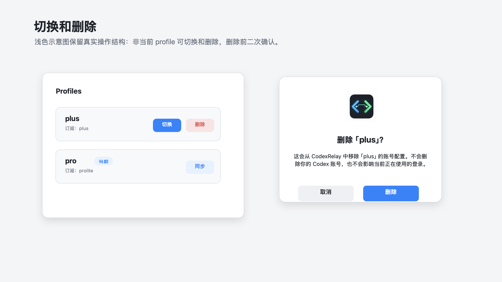

# Codex Relay 使用手册

Codex Relay 用来管理本机多个 Codex 登录配置，并在需要时切换当前使用的账号。它只管理本机登录配置；Codex 的项目、会话、历史记录、插件和个人设置仍由 Codex 自己管理。

当前发布内容包括：

- `CodexRelay-macos.dmg`：macOS 菜单栏 App。
- `codex-relay-windows-amd64.zip`：Windows CLI preview。
- `codex-relay` / `codex-relay.exe`：命令行工具。

## 下载和校验

下载文件后，建议先校验文件是否完整。

macOS：

```bash
shasum -a 256 -c CodexRelay-macos.dmg.sha256
```

Windows PowerShell：

```powershell
$expected = (Get-Content .\codex-relay-windows-amd64.zip.sha256).Split()[0].ToUpperInvariant()
$actual = (Get-FileHash .\codex-relay-windows-amd64.zip -Algorithm SHA256).Hash.ToUpperInvariant()
if ($actual -ne $expected) { throw "sha256 mismatch" }
```

校验通过后再安装或解压。

## macOS 菜单栏 App

### 安装

1. 下载 `CodexRelay-macos.dmg` 和 `CodexRelay-macos.dmg.sha256`。
2. 双击打开 `CodexRelay-macos.dmg`。
3. 把 `CodexRelay.app` 拖到 `Applications`。
4. 第一次打开时，建议右键点击 `CodexRelay.app`，选择“打开”。
5. 如果 macOS 提示无法验证开发者，选择“打开”继续。
6. 如果仍然被拦截，打开“系统设置 -> 隐私与安全性”，在提示区域点击“仍要打开”。



不需要运行 `sudo`，也不要修改系统安全设置。

### 第一次使用

打开 App 后，屏幕顶部菜单栏会出现 `CodexRelay`。点击它可以看到账号配置列表、当前账号、用量和操作按钮。



如果你已经在 Codex 中登录过账号，可以先创建第一个 profile。建议使用容易识别的名字，例如：

```text
work
personal
plus
pro
```

profile 只是本机里的账号配置名称，用来区分不同账号，不会修改你的 Codex 或 ChatGPT 账号。

### 添加账号

添加账号前，先确认浏览器里登录的是你要添加的 ChatGPT 账号。

1. 点击菜单栏面板右上角的 `+`。
2. 输入 profile 名称。
3. 确认后，App 会显示一个登录地址。
4. 复制这个地址，在浏览器中打开。
5. 在浏览器里完成登录授权。
6. 回到 Codex Relay，等待它自动保存并刷新。



如果浏览器已经登录了另一个 ChatGPT 账号，可以先在浏览器里切换账号，或者把 App 里显示的登录地址复制到新的浏览器窗口中打开。

### 查看和同步用量

菜单栏面板会显示当前账号的用量信息。常用操作：

- `刷新`：重新读取当前状态。
- `同步全部`：刷新所有 profile 的用量信息。
- `同步`：只刷新某一个 profile 的用量信息。
- `诊断`：查看当前环境是否能正常工作。

如果用量无法获取，App 会显示失败原因。此时先点 `诊断`，再确认 Codex 登录状态是否有效。

### 切换账号

在账号列表里点击目标 profile 的 `切换`。

如果 Codex 正在运行，Codex Relay 会提示你确认。确认后，它会关闭 Codex、切换账号，再重新打开 Codex。



如果切换失败，先点 `诊断` 看提示。常见原因是 Codex 还没有完全退出，或目标 profile 不可用。

### 命令行工具提示

macOS App 自带可用的命令行工具，不依赖你系统里已有的全局 `codex-relay`。如果菜单栏面板提示“安装命令行工具”或“更新命令行工具”，点击对应按钮即可让终端里的 `codex-relay` 与 App 使用的版本保持一致。

如果终端里的 `codex-relay` 比 App 更新，App 不会自动覆盖它。此时建议更新 App，避免终端和菜单栏看到的信息不一致。

## Windows CLI Preview

Windows 版本目前是 CLI preview，暂不包含图形界面、托盘、安装器、自动更新和远程控制能力。

### 解压并运行

```powershell
Expand-Archive -Force .\codex-relay-windows-amd64.zip .\codex-relay-windows-amd64
cd .\codex-relay-windows-amd64
.\codex-relay.exe --version
.\codex-relay.exe setup
.\codex-relay.exe doctor
.\codex-relay.exe status
```

### 创建第一个 profile

如果 Windows 上已经登录过 Codex：

```powershell
.\codex-relay.exe profile init work
.\codex-relay.exe profile list
.\codex-relay.exe status
```

如果要添加新账号：

```powershell
.\codex-relay.exe profile add personal
```

按命令提示在浏览器中完成登录授权。

### 同步用量

```powershell
.\codex-relay.exe profile sync work
.\codex-relay.exe profile sync --all
.\codex-relay.exe status
```

如果用量无法获取，命令会返回失败原因。不要只看缓存结果；以 `profile sync` 或 `status` 的最新输出为准。

### 切换账号

切换前先退出 Codex App 和正在运行的 Codex 服务：

```powershell
.\codex-relay.exe switchcheck personal
.\codex-relay.exe switch personal
.\codex-relay.exe profile current
```

如果 `switchcheck` 提示 Codex 仍在运行，请先关闭 Codex，再重新执行切换。

## CLI 命令速查

macOS 终端使用 `codex-relay`，Windows PowerShell 使用 `.\codex-relay.exe`。下面示例用 `codex-relay` 表示命令本体。

### 初始化和诊断

```bash
codex-relay setup
codex-relay doctor
codex-relay doctor --json
codex-relay status
codex-relay status --json
```

### 管理 profile

```bash
codex-relay profile init work
codex-relay profile add personal
codex-relay profile list
codex-relay profile inspect work
codex-relay profile sync work
codex-relay profile sync --all
codex-relay profile rename old-name new-name
codex-relay profile remove old-name
codex-relay profile current
```

### 切换和恢复

```bash
codex-relay switchcheck personal
codex-relay switch personal
codex-relay history
codex-relay backup list
codex-relay backup restore <backup-id>
```

### 打开和关闭 Codex

```bash
codex-relay app quit
codex-relay app open
```

这两个命令主要用于 macOS App 流程。Windows preview 下请按提示手动关闭或打开 Codex。

## 常见问题

### macOS 打不开 App

右键点击 App，选择“打开”。如果仍然被拦截，到“系统设置 -> 隐私与安全性”里点击“仍要打开”。

### 添加账号时一直没有完成

通常是浏览器里没有登录正确的 ChatGPT 账号。复制 App 或 CLI 显示的登录地址，用新的浏览器窗口打开，再完成登录。

### 切换后 Codex 里还是旧账号

先退出 Codex，再回到 Codex Relay 切换一次。切换完成后再打开 Codex。

### 用量没有变化

先执行同步：

```bash
codex-relay profile sync --all
codex-relay status
```

如果仍然没有变化，查看命令或 App 显示的失败原因，再运行 `codex-relay doctor`。

### 不想保留某个 profile

删除 profile 只会移除本机保存的这份登录配置，不会删除你的 Codex 或 ChatGPT 账号。

```bash
codex-relay profile remove old-name
```
